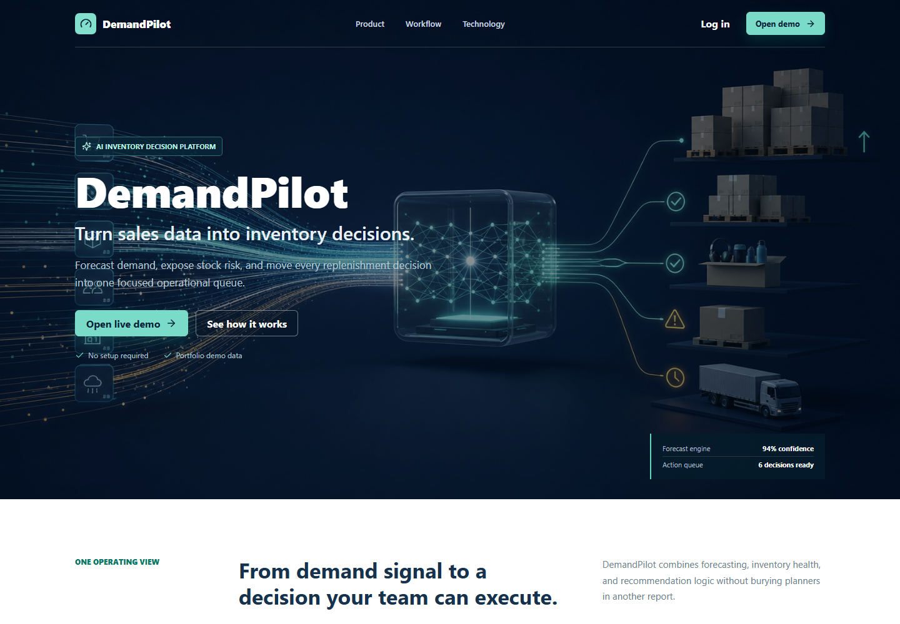
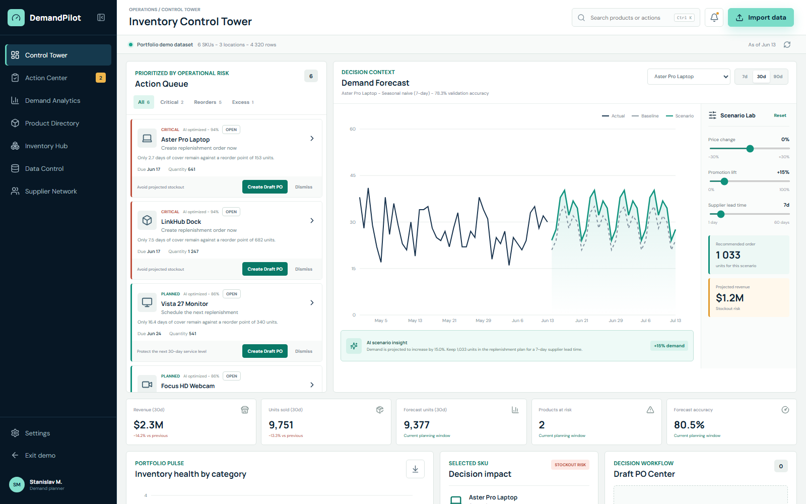
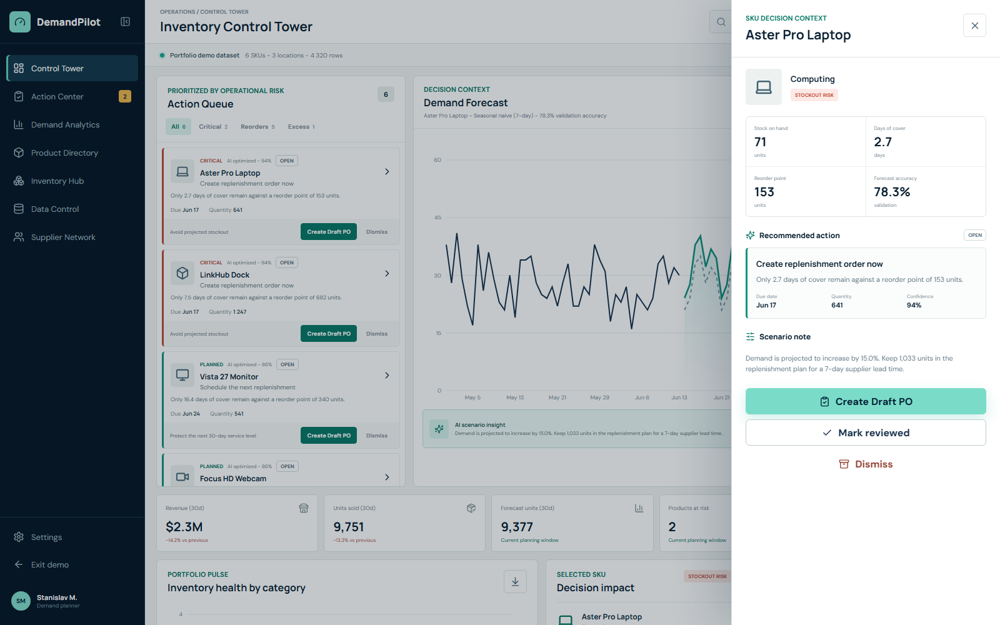

# DemandPilot

AI-powered inventory decision platform for e-commerce and operations teams.

DemandPilot turns sales history into a prioritized queue of replenishment and inventory actions. It combines transparent demand forecasting, scenario simulation, stock-risk detection, data-quality controls, and exportable Draft Purchase Orders in one operational workspace.



## Business Problem

Retail teams often plan inventory in spreadsheets after stockouts or excess inventory have already appeared. DemandPilot provides an earlier, measurable view of future demand:

- Start every planning session with a risk-ranked Action Queue
- Forecast demand by product over 7, 30, or 90 days
- Compare baseline forecasting strategies through holdout validation
- Detect products at risk of stockout or overstock
- Calculate safety stock, reorder points, and suggested order quantities
- Simulate price, promotion, and supplier lead-time changes directly on the forecast
- Convert replenishment recommendations into downloadable Draft PO files
- Review, dismiss, and track recommendation status through a lightweight workflow
- Open SKU-level decision context with inventory, forecast, and AI rationale
- Expose every calculation through a documented REST API

## Current Product

## Inventory Control Tower



The repository currently contains:

- A product landing page and returning-user Control Tower route
- A prioritized recommendation engine for critical reorders, planned replenishment, and excess-stock actions
- Action rationale, confidence, due date, quantity, and expected business impact
- Action lifecycle states: Open, Draft created, Reviewed, and Dismissed
- A SKU detail drawer with stock, cover, reorder point, forecast accuracy, and action rationale
- A simplified Draft Purchase Order Center with CSV export
- A deterministic retail dataset generator
- Daily sales aggregation and KPI calculations
- Seasonal-naive and trend/weekday forecasting candidates
- Automatic model selection using holdout MAE
- Forecast confidence ranges and WAPE reporting
- Inventory risk and replenishment recommendations
- An integrated Scenario Lab with a live alternative forecast curve and AI insight
- CSV/XLSX import with automatic column alias mapping
- Data-quality reporting for rejected rows, duplicates, missing values, and defaults
- Persistent active-dataset selection with one-click demo reset
- Responsive React dashboard backed by live API data
- Backend tests, frontend production build, Docker, and CI

## Decision Workflow



The v0.4 workflow is built around a planner's daily loop:

1. Filter the Action Queue by all actions, critical risks, reorders, or excess stock.
2. Open a SKU decision drawer to inspect the business rationale behind the recommendation.
3. Create a Draft PO for reorder actions or mark non-order actions as reviewed.
4. Track generated Draft POs in the Draft PO Center and export individual CSV files or the full register.

This keeps the current release honest: DemandPilot recommends and stages decisions, while full ERP approval, supplier dispatch, receiving, and audit persistence remain future integration steps.

## Architecture

```text
React + TypeScript product experience
            |
         FastAPI
            |
Recommendation / Forecasting / Inventory services
            |
CSV/XLSX import -> validation -> normalized active dataset
```

PostgreSQL and Redis services are included in the local stack so account-level persistence and background forecast jobs can be added without restructuring the product.

## Tech Stack

**Backend:** Python, FastAPI, pandas, NumPy, Pydantic, openpyxl
**Frontend:** React, TypeScript, Vite, Recharts, Lucide
**Infrastructure:** Docker Compose, PostgreSQL, Redis, GitHub Actions
**Testing:** pytest, FastAPI TestClient, TypeScript compiler

## Run Locally

### Docker

```bash
docker compose up --build
```

Open:

- Dashboard: `http://localhost:8080`
- API documentation: `http://localhost:8000/docs`

### Development

Backend:

```bash
python -m venv .venv
.venv\Scripts\activate
pip install -e "backend[dev]"
uvicorn app.main:app --app-dir backend --reload
```

Frontend:

```bash
cd frontend
npm install
npm run dev
```

The demo CSV is generated automatically on first backend startup. It can also be rebuilt explicitly:

```bash
python scripts/generate_demo_data.py
```

Custom datasets can be imported from the dashboard. See [docs/DATA_FORMAT.md](docs/DATA_FORMAT.md) for required fields, aliases, defaults, and validation rules.

## API

| Method | Endpoint | Purpose |
|---|---|---|
| `GET` | `/api/v1/dashboard/summary` | Portfolio KPIs and product revenue |
| `GET` | `/api/v1/datasets/active` | Active dataset and quality report |
| `POST` | `/api/v1/datasets/import` | Validate and activate CSV/XLSX data |
| `POST` | `/api/v1/datasets/reset` | Return to the reproducible demo dataset |
| `GET` | `/api/v1/products` | Product inventory and risk table |
| `GET` | `/api/v1/actions` | Prioritized inventory recommendation queue |
| `POST` | `/api/v1/actions/{action_id}/draft` | Create an exportable Draft Purchase Order |
| `GET` | `/api/v1/forecast/{product_id}` | Historical demand and selected forecast |
| `POST` | `/api/v1/scenarios` | Scenario metrics, AI insight, and forecast curve |
| `GET` | `/health` | Service health |

## Roadmap

See [docs/ROADMAP.md](docs/ROADMAP.md) for the full product plan.
Release history is documented in [CHANGELOG.md](CHANGELOG.md).

## Repository Name and Description

**Name:** `demandpilot`
**GitHub description:** `AI-powered inventory decision platform with demand forecasting, SKU context, action workflow, and Draft PO exports.`
